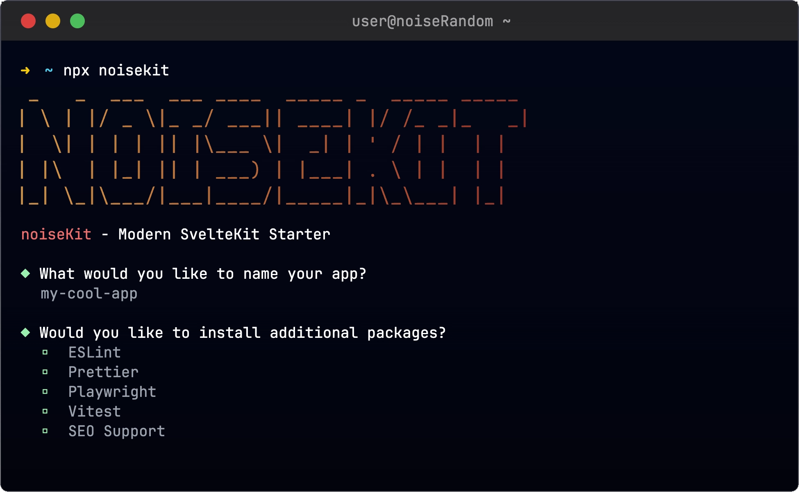

<p align="center">

</p>

`noisekit` is a CLI tool to quickly scaffold a new SvelteKit project with the noiseKit stack.

<p align="center">

</p>

## The noiseKit Stack

A web dev stack by noiseRandom.

- [SvelteKit](https://svelte.dev/)
- [TypeScript](https://www.typescriptlang.org/)
- [Tailwind CSS](https://tailwindcss.com/)
- [Shadcn](https://next.shadcn-svelte.com/)

## Getting Started

To start a new project using the noiseKit stack, run the following command:

```bash
npx noisekit@latest
```

After the process completes, you can navigate into your new SvelteKit project directory:

```bash
cd <your-project-name>
npm install
npm run dev
```

## License

[](https://opensource.org/licenses/MIT)
